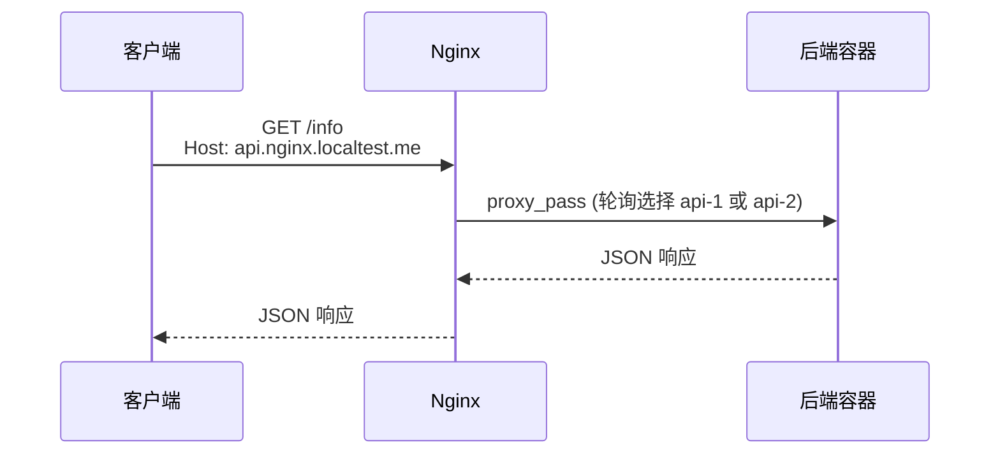
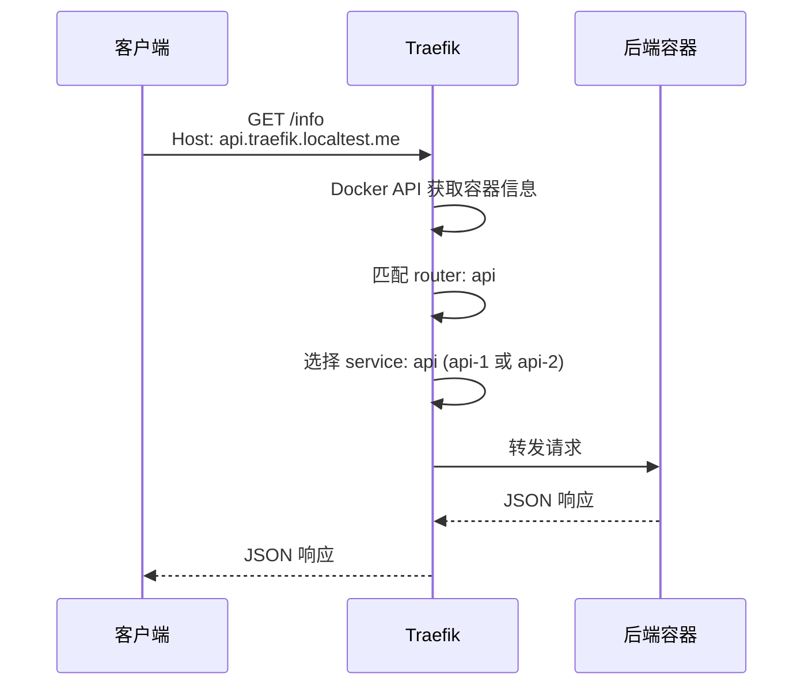

# API 网关：Nginx 与 Traefik 配置与使用

本节课聚焦 API 网关的核心概念，并通过 Nginx 和 Traefik 两个实际方案演示：Host 分流、路径分流、多实例负载均衡以及代理头透传。

## API 网关

API 网关（API Gateway）是微服务架构中的统一入口层，所有客户端请求都经过网关转发到后端服务。它的核心职能包括：

- **路由分发**：根据请求特征（Host、路径、Header 等）将请求转发到不同后端服务
- **负载均衡**：将请求分配到多个后端实例，提升系统吞吐能力
- **协议转换**：支持 HTTP、HTTP/2、WebSocket 等多种协议
- **安全防护**：隐藏后端服务真实地址，统一处理认证、限流等
- **日志与监控**：记录所有请求，便于可观测性分析

## Nginx 与 Traefik

| 维度     | Nginx                                   | Traefik                            |
| -------- | --------------------------------------- | ---------------------------------- |
| 配置方式 | 静态配置文件，手动编写路由规则          | 动态发现，路由规则写在容器标签中   |
| 服务发现 | 需要手动维护 upstream 列表              | 自动从 Docker/K8s 等平台发现服务   |
| 负载均衡 | 支持多种策略（轮询、IP Hash 等）        | 支持多种策略，自动感知后端实例变化 |
| 学习曲线 | 配置简洁，但新增服务需改配置            | 概念较多，但声明式标签更贴近业务   |
| 适用场景 | 固定服务、传统架构、K8s 外的 Nginx 使用 | 云原生、Docker Compose/K8s 环境    |

## Nginx 详解

### 配置结构

这份示例配置可以分成三部分：

```
worker_processes auto;   # 自动按 CPU 核数设置 worker 进程数
events {
    worker_connections 1024;  # 每个 worker 可处理的最大连接数
}
http {           # HTTP 相关配置
    upstream {}  # 上游服务器组
    server {}    # 虚拟主机配置
    location {}  # URL 匹配规则
}
```

### 全局进程配置

`worker_processes` 是顶层全局配置。

```nginx
worker_processes auto;
```

- `worker_processes auto;`：让 Nginx 根据运行环境自动确定 worker 进程数

这个配置决定 Nginx 启动多少个 worker 进程来处理请求。

### events（事件模型配置）

`events` 块是事件模型相关配置，用来描述每个 worker 如何处理连接。

在这个 demo 中，写法如下：

```nginx
events {
    worker_connections 1024;
}
```

- `worker_connections 1024;`：表示每个 worker 最多可同时处理 1024 个连接

### Upstream（上游服务器组）

Upstream 定义后端服务器池，是负载均衡的基础：

```nginx
upstream api_backend {
    server api-1:8080;  # Docker Compose 服务名
    server api-2:8080;
}
```

Nginx 会自动对 `api_backend` 中的实例进行轮询负载均衡。

### Server + Location（虚拟主机与路由）

```nginx
server {
    listen 8080;
    server_name api.nginx.localtest.me;  # 根据 Host 匹配

    location / {
        proxy_pass http://api_backend;   # 转发到上游组
    }
}
```

### 代理头透传

反向代理时，后端服务无法直接获取客户端信息，需要通过 Header 透传：

```nginx
proxy_set_header Host $host;                      # 原始域名
proxy_set_header X-Real-IP $remote_addr;          # 真实客户端 IP
proxy_set_header X-Forwarded-For $proxy_add_x_forwarded_for;  # 转发链路 IP
proxy_set_header X-Forwarded-Host $host;          # 原始 Host
proxy_set_header X-Forwarded-Proto $scheme;       # 原始协议 http/https
```

### 请求流程示意



## Traefik 详解

### 核心概念

Traefik 使用声明式配置，路由规则不是写在中央配置文件中，而是"附着"在各个服务上：

- **Static Configuration**：`traefik.yml` 定义 Traefik 自身如何启动、监听哪个端口、从哪里发现服务
- **Dynamic Configuration**：通过 Docker 容器标签（labels）定义具体路由规则

### traefik.yml 静态配置

```yaml
entryPoints:
  web:
    address: ":8080"           # 容器内监听端口

providers:
  docker:
    endpoint: "unix:///var/run/docker.sock"  # Docker socket
    exposedByDefault: false    # 默认不暴露，需显式声明
```

### Docker Labels 动态路由

在 `docker-compose.yml` 中为服务添加标签：

```yaml
services:
  api-1:
    labels:
      traefik.enable: "true"
      traefik.http.routers.api.rule: "Host(`api.traefik.localtest.me`)"
      traefik.http.routers.api.entrypoints: web
      traefik.http.services.api.loadbalancer.server.port: "8080"
```

### 路由规则组合

```yaml
# Host 分流
traefik.http.routers.admin.rule: "Host(`admin.traefik.localtest.me`)"

# Host + 路径分流
traefik.http.routers.echo.rule: "Host(`traefik.localtest.me`) && PathPrefix(`/echo`)"
```

### 多实例自动负载均衡

`api-1` 和 `api-2` 使用相同的 router 和 service 名称，且被同一个provider发现，Traefik 会自动将它们合并为一个负载均衡后端池：

```yaml
# api-1 和 api-2 共用这些标签
traefik.http.routers.api.service: api
traefik.http.services.api.loadbalancer.server.port: "8080"
```

### 请求流程示意



## Host 分流（Virtual Hosting）

### 什么是 Host 分流？

同一台服务器（同一个 IP:端口）根据请求的 `Host` 头将流量分发到不同后端服务。

### Nginx 实现

```nginx
# 三个 server 共享 8080 端口，按 server_name 区分
server {
    listen 8080;
    server_name api.nginx.localtest.me;
    location / {
        proxy_pass http://api_backend;
    }
}

server {
    listen 8080;
    server_name admin.nginx.localtest.me;
    location / {
        proxy_pass http://admin_backend;
    }
}
```

### Traefik 实现

```yaml
# api-1 / api-2
traefik.http.routers.api.rule: "Host(`api.traefik.localtest.me`)"

# admin
traefik.http.routers.admin.rule: "Host(`admin.traefik.localtest.me`)"
```

## 路径分流

### 什么是路径分流？

同一域名下，根据 URL 路径前缀将请求分发到不同服务。

### Nginx 实现

```nginx
server {
    listen 8080;
    server_name nginx.localtest.me;

    location /echo/ {
        proxy_pass http://echo_backend;
    }
}
```

访问 `http://nginx.localtest.me:8081/echo/inspect` 会转发到 `echo` 服务。

### Traefik 实现

```yaml
traefik.http.routers.echo.rule: "Host(`traefik.localtest.me`) && PathPrefix(`/echo`)"
```

## 负载均衡

### Nginx 负载均衡策略

Nginx 默认使用轮询（Round Robin）策略，无需额外配置即可实现请求分发：

```nginx
upstream api_backend {
    server api-1:8080;
    server api-2:8080;
}
```

连续请求会依次分发到 `api-1` 和 `api-2`。

### Traefik 负载均衡

Traefik 自动感知同一 service 下的所有容器实例，自动进行负载均衡：

```yaml
# api-1 labels
traefik.http.routers.api.service: api
traefik.http.services.api.loadbalancer.server.port: "8080"

# api-2 labels (同样配置)
traefik.http.routers.api.service: api
traefik.http.services.api.loadbalancer.server.port: "8080"
```

两个容器共用 `api` service，Traefik 自动合并为后端池。

## 代理头透传的重要性

### 常见代理头说明

| Header                | 作用                          | 示例                        |
| --------------------- | ----------------------------- | --------------------------- |
| `Host`              | 原始请求域名                  | `api.nginx.localtest.me`  |
| `X-Real-IP`         | 真实客户端 IP（非标准但常用） | `192.168.1.100`           |
| `X-Forwarded-For`   | 转发链路上的所有 IP           | `192.168.1.100, 10.0.0.1` |
| `X-Forwarded-Host`  | 原始请求 Host                 | `api.nginx.localtest.me`  |
| `X-Forwarded-Proto` | 原始协议                      | `http` 或 `https`       |

### 后端服务获取真实信息

未透传时，后端服务看到的都是网关的地址：

```json
// 未透传
{"client_ip": "172.19.0.2", "host": "nginx"}

 // 透传后
{"client_ip": "192.168.1.100", "host": "api.nginx.localtest.me",
 "forwarded": {"X-Forwarded-For": "192.168.1.100", ...}}
```

---

## Demo

### 项目结构

```
getway_demo/
├── cmd/
│   ├── api/main.go      # API 服务（多实例）
│   ├── admin/main.go    # Admin 管理服务
│   └── echo/main.go     # Echo 回显服务
├── internal/common/     # 共享响应逻辑
├── deployments/
│   ├── docker-compose.yml   # 整体编排
│   ├── nginx/nginx.conf     # Nginx 静态路由配置
│   └── traefik/traefik.yml # Traefik 静态配置
├── Dockerfile                # 多阶段构建，自动编译 Go 程序
└── Makefile
```

### 服务说明

| 服务          | 端口           | 说明                         |
| ------------- | -------------- | ---------------------------- |
| api-1 / api-2 | 8080           | API 服务，双实例演示负载均衡 |
| admin         | 8080           | Admin 管理服务               |
| echo          | 8080           | Echo 回显服务，用于验证路由  |
| nginx         | 8081（宿主机） | Nginx 网关入口               |
| traefik       | 8092（宿主机） | Traefik 网关入口             |

一般我们是让nginx或者traefik直接监听80和443端口，但这里为了同时演示这两个和简单，没有使用这些端口

### 启动步骤

Dockerfile 使用多阶段构建，在容器内自动编译 Go 程序，无需手动预编译。

```bash
# 直接启动（docker-compose.yml 已配置好 build）
docker compose -f deployments/docker-compose.yml up --build -d

# 或使用 Makefile
make up
```

### 验证命令

```bash
# Nginx Host 分流
curl -s http://api.nginx.localtest.me:8081/info
curl -s http://admin.nginx.localtest.me:8081/info

# Nginx 路径分流
curl -s http://nginx.localtest.me:8081/echo/inspect

# Traefik Host 分流
curl -s http://api.traefik.localtest.me:8092/info
curl -s http://admin.traefik.localtest.me:8092/info

# Traefik 路径分流
curl -s http://traefik.localtest.me:8092/echo/inspect

# 负载均衡验证（连续请求 instance 应在 api-1/api-2 间切换）
for i in $(seq 1 6); do curl -s http://api.nginx.localtest.me:8081/info; echo; done
for i in $(seq 1 6); do curl --noproxy '*' -s http://api.traefik.localtest.me:8092/info; echo; done
```

### 预期返回示例

```json
// GET /info 返回
{
  "service": "api",
  "instance": "api-1",
  "method": "GET",
  "path": "/info",
  "host": "api.nginx.localtest.me",
  "client_ip": "真实客户端IP",
  "forwarded": {
    "X-Forwarded-For": "真实客户端IP",
    "X-Forwarded-Host": "api.nginx.localtest.me",
    "X-Forwarded-Proto": "http"
  }
}
```

## 总结

本节课核心要点：

1. **API 网关是统一入口**：所有客户端请求经过网关，隐藏后端细节，统一处理路由、负载均衡、安全防护
2. **Nginx 是静态配置网关**：路由规则集中在配置文件，新增服务需要修改配置并重启
3. **Traefik 是动态发现网关**：通过 Docker label 声明路由，自动发现并注册服务，更适合云原生场景
4. **Host 分流**：根据请求域名将流量分发到不同后端服务
5. **路径分流**：根据 URL 路径前缀进行流量分发
6. **负载均衡**：多实例场景下自动分发请求，提升吞吐能力和容错性
7. **代理头透传**：让后端服务获取真实的客户端信息（IP、域名、协议等）

## 作业

- 这节课上演示的nginx和traefik的负载均衡都采取的默认的轮询，可以自己下去了解一下加权轮询、一致性哈希等负载均衡策略如何配置
- 这节课的这两种api网关的配置都采取了docker，可以自己进一步了解一下不使用docker怎么配置，如何与服务发现与注册中心结合使用
- traefik如何配置中间件，比如认证、限流等，nginx没有middleward这个概念，但它能实现类似效果，可以自己下去了解一下如何配置
- 本次作业不需要提交
